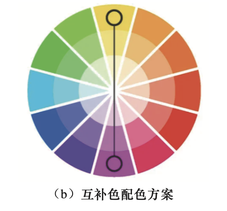
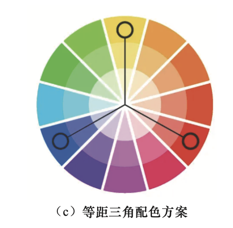
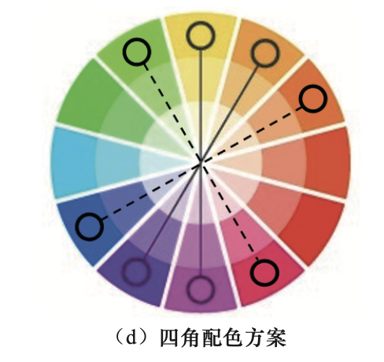

# 第一章：科研论文配图的绘制基础与配色基础

## 1.1 科研论文配图的绘制基础

### 1.1.1 绘制规范

科研论文配图主要包括：坐标轴、坐标轴标签、主刻度、次刻度和图例等。

### 1.1.2 绘制原则

1. 必要性原则
2. 易读性原则
3. 一致性原则

## 1.2 科研论文配图的配色基础

### 1.2.1 色彩模式

1. RGB色彩模式
2. CMYK（青色、品红色、黄色、黑色）色彩模式
3. HEX色彩模式，常用语在代码中表示颜色

### 1.2.2 色轮配色原理

1. 单色配色方案

   

2. 互补色配色方案

   

3. 等距三角配色方案

   

4. 四角配色方案

   

### 1.2.3 配色主题

大体有三种：单色系、双色渐变系、多色系

### 1.2.4 配色工具

在需要自定义色彩时使用，暂时没有需求。