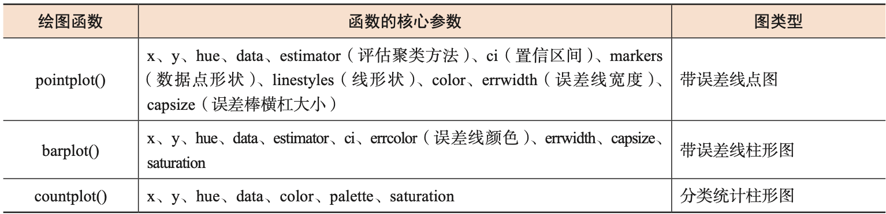

# Seaborn

`Seaborn`在`Matplotlib`的基础上进行了更高级的封装，使用户可以用少量的代码绘制出更结构化、复杂化的关系。

`Seaborn` 将可绘制的图进行了分类，包括：

1. 统计关系型

   

2. 数据分布型

   

3. 分类数据型

   

   

4. 回归模型分析型

   

5. 多子图网格型（严格来讲多子图网络型不应该出现在该层级，因为子图可以为上述四个任意一种图型）

   1. `FaceGrid()`函数：实现数据集中任一变量的分布和数据集子集中多个变量 之间关系的可视化展示。
   2. `PairGrid()`函数：绘制数据集中具有成对关系的多子图网格型图。

